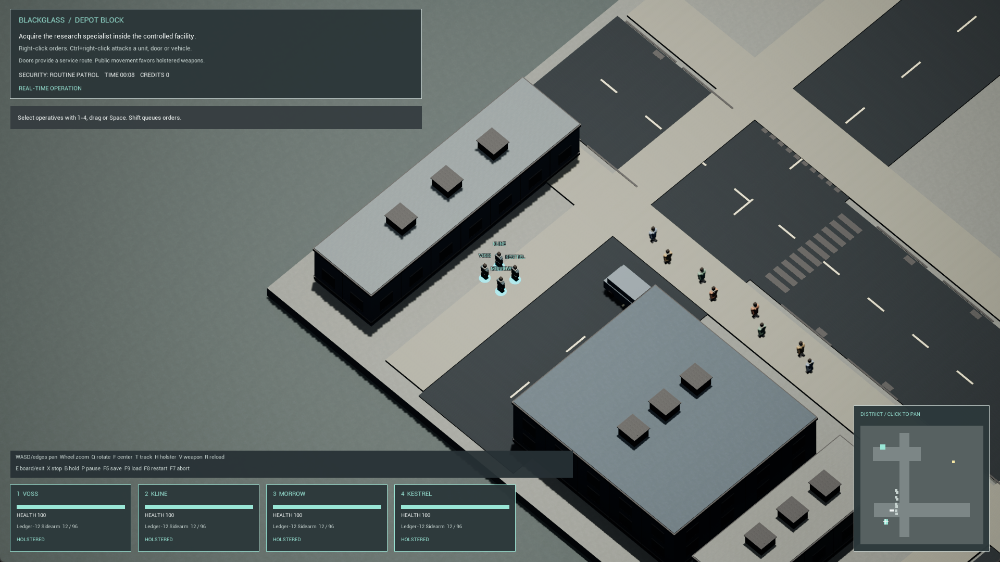

# BLACKGLASS

Original real-time isometric corporate tactics for offline Windows PC. The 1993 PC Syndicate is the mechanics benchmark; all project characters, writing and artwork are original or properly licensed. BLACKGLASS is a working title.

**Milestone 1 is a tested native Unreal foundation. It preserves four-operative selection and real-time orders, with a true orthographic camera. Its procedural buildings and characters remain placeholder art and do not meet the polished vertical-slice target.**

Development source: [blackglass/milestone-1](https://github.com/Velamj/BLACKGLASS/tree/blackglass/milestone-1). Review: [draft PR #1](https://github.com/Velamj/BLACKGLASS/pull/1).

## Build and play

On Windows with Unreal Engine 5.8.3, supported MSVC and the Windows SDK, run from this repository:

~~~powershell
powershell -ExecutionPolicy Bypass -File Scripts/Build-Native.ps1 -Mode Editor
powershell -ExecutionPolicy Bypass -File Scripts/Launch-Foundation.ps1
~~~

For the tested Development Windows archive:

~~~powershell
powershell -ExecutionPolicy Bypass -File Scripts/Build-Native.ps1 -Mode Package
powershell -ExecutionPolicy Bypass -File Scripts/Launch-Packaged.ps1
~~~

The editor project is BLACKGLASS.uproject; the map is /Game/Maps/DepotBlock. The local packaged launcher is Artifacts/Windows/Blackglass.exe. Select with 1–4 or Space; right-click to move/interact/attack; Shift queues orders. P pauses, E boards/exits, H holsters, V switches weapons, F5/F9 save/load, F8 restarts. [Complete controls](Docs/CONTROLS.md).

Acquire Iona Vale inside the facility and extract her with every living operative. Four agents, two weapons, local civilians/security, an interactive van, obstruction-aware combat, mission outcomes and native persistence are implemented. This specialist uses a contextual escort; neural override is pending.

## Actual evidence

The focused Unreal scenario Blackglass.Foundation.Runtime passed in 116.17 seconds with zero errors and one documented navigation initialization warning. Final Windows packaging succeeded. Ordinary controls completed the foot mission in Package04; final Package05 verified rendering, four-operative boarding/travel/exit and won-state save/load without duplicate rewards. These are separate headless, packaged and ordinary-input checks, not claims about campaign completeness.

The visual pass adds original concrete/asphalt textures, a material graph, instanced building/street detail, articulated coat silhouettes and readable HUD labels. Production models, rigs, audio, roof cutaways and stronger environment art remain pending. [Actual won-state load](Docs/Evidence/package05-won-save-load.png) retains the earlier ordinary-control mission result.

The final package completed two 10,000-frame captures and exited cleanly at a measured physical 1920 × 1080. The second capture averaged 11.31 ms per frame (about 88.44 FPS), with 12.14 ms p95 and a 59.71 ms worst frame. This unpaused idle district contained 17 units, one van and two doors on a Core Ultra 7 258V / integrated Arc 140V system. The supported synchronous CSV profiler avoids an observed engine capture-worker shutdown fault; its overhead is included. Heavy combat and full-mission performance remain unmeasured. [Measured performance](Docs/PERFORMANCE.json).

- [Verification and acceptance status](Docs/VERIFICATION.md).
- [Status, defects and next bounded step](Docs/STATUS.md).
- [Build, content-generation and profiling instructions](Docs/BUILD.md).
- [Fidelity ledger](Docs/FIDELITY_LEDGER.md).
- [Asset sources, licenses and placeholders](Docs/ASSET_MANIFEST.md).
- [Verified editor bridge setup](Docs/UNREAL_MCP.md).
- [Full seven-part master brief](Docs/MASTER_BRIEF.md).

Hostile Acquisition, the ten-operation campaign alpha and eventual 50-territory authored campaign remain in scope. Neural systems, cybernetics, research, economy, rival strategy and campaign progression are not implemented or counted complete. The portable simulation remains a separate test fixture; native Unreal actor state owns the running game.
