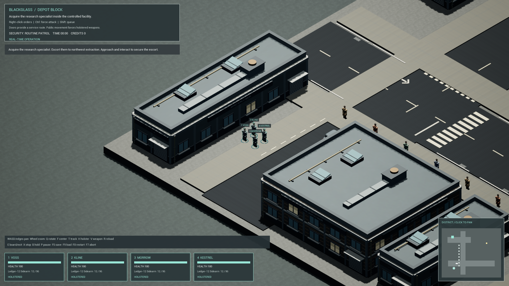

# BLACKGLASS

Original real-time isometric corporate tactics for offline Windows PC. The 1993 PC Syndicate is the gameplay benchmark; project characters, writing and artwork are original or properly licensed. BLACKGLASS is a working title.

**Milestone 1 is a tested native Unreal foundation. The current graphics pass adds industrial facades, original shaped character/van meshes, a classic orthographic isometric angle, thin selection rings and controlled-operative silhouettes. Production art, final rigs/audio and the polished vertical slice remain unfinished.**

Source: [blackglass/milestone-1](https://github.com/Velamj/BLACKGLASS/tree/blackglass/milestone-1). Review: [draft PR #1](https://github.com/Velamj/BLACKGLASS/pull/1).

## Build and play

On Windows with the verified Unreal Engine 5.8.3, MSVC and Windows SDK, run from this checkout:

~~~powershell
powershell -ExecutionPolicy Bypass -File Scripts/Build-Native.ps1 -Mode Editor
powershell -ExecutionPolicy Bypass -File Scripts/Launch-Foundation.ps1
~~~

To package and launch: run `Scripts/Build-Native.ps1 -Mode Package`, then `Scripts/Launch-Packaged.ps1`. The project is `BLACKGLASS.uproject`, map `/Game/Maps/DepotBlock`; the local packaged launcher is `Artifacts/Windows/Blackglass.exe`. Keep its complete archive together. [Build and asset-generation instructions](Docs/BUILD.md).

Select with 1–4 or Space; right-click to move/interact/attack; Shift queues orders. P pauses, E boards/exits, H holsters, V switches weapons, F5/F9 save/load, F8 restarts. Acquire Iona Vale and extract her with every survivor for one 6,000-credit reward. [Complete controls](Docs/CONTROLS.md).

## Actual current evidence

Package07 built successfully in 42.91 seconds and launched at a physically measured 1920 × 1080. Its cooked assets were independently listed. The screenshot is an unchanged capture from the native game viewport with 32 render warmup frames; it is not concept art or a physical-input playthrough.

The native integration scenario passed in 115.85 seconds with zero errors and the existing documented navigation initialization warning. Nine new outline-state checks cover selection, vehicles, casualties, disk load and restart while excluding NPCs. The final cloth/ring refinement and corrected static sign placement are included in this passing run. These checks preserve the real-time four-operative gameplay; they do not prove final presentation or every physical binding.

The Windows test desktop's active screensaver currently blocks new ordinary-input, occluded-selection and representative visible-window performance checks. Previous Package04/05 playthrough/control results and Package05's 88.44 FPS idle measurement remain historical. No current 60 FPS claim is made. [Verification and limits](Docs/VERIFICATION.md).

- [Status and next bounded checks](Docs/STATUS.md).
- [Historical measured performance](Docs/PERFORMANCE.json).
- [Fidelity ledger](Docs/FIDELITY_LEDGER.md).
- [Asset sources, licenses and placeholder status](Docs/ASSET_MANIFEST.md).
- [Verified editor bridge](Docs/UNREAL_MCP.md).
- [Full seven-part master brief](Docs/MASTER_BRIEF.md).

Hostile Acquisition, the ten-operation alpha and eventual 50-territory authored campaign remain in scope. Neural systems, cybernetics, research, economy, rivals and a subsequent operation are not implemented or counted complete. Native Unreal actor state owns gameplay; the portable simulation is a separate test fixture.
